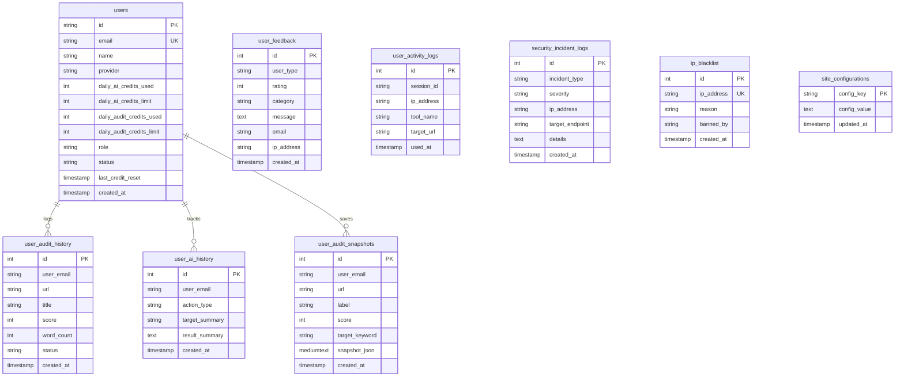

# AnalyzeSERP — Comprehensive Marketing Intelligence & Product Discovery Audit

> **Document Type:** Technical Product & Marketing Intelligence Audit  
> **Target Product:** AnalyzeSERP (Repository: `sarfraj-yusuf/analyze-serp`)  
> **Audit Date:** September 2026  
> **Auditor Role:** Senior Product Marketing Researcher, Growth Strategist & Technical Product Analyst  
> **Objective:** Extract all factual, verifiable product capabilities, technical architecture, user flows, monetization signals, and growth assets from the repository to inform a subsequent 90-Day Marketing Strategy.

---

## 1. Repository Overview

AnalyzeSERP is a modern, high-performance web application designed for on-page SEO competitor intelligence, lexical SERP benchmarking, and technical website diagnostics. The codebase is organized as a monolithic Next.js full-stack application leveraging the App Router architecture.

### 1.1 Technology Overview

| Area | Finding | Evidence (Source File / Path) |
| :--- | :--- | :--- |
| **Frontend Framework** | Next.js 15.1.7 (React 19.0.0, React DOM 19.0.0) | `package.json` (lines 18, 21-22) |
| **Styling & Design System** | Tailwind CSS v4 (`@tailwindcss/postcss` 4.0.7), PostCSS 8.5.2, custom CSS variables, Dark/Light theme switching, Lucide React icons (0.475.0) | `package.json` (lines 16, 29, 36); `src/app/globals.css` |
| **Backend Runtime** | Next.js App Router Node.js server runtime (`api/` route handlers and React Server Components) | `src/app/api/audit/route.ts`, `src/app/api/ai/generate/route.ts` |
| **Scraping / DOM Engine** | Cheerio 1.0.0 (high-speed server-side HTML AST parsing; non-headless, zero-browser overhead) | `package.json` (line 12); `src/lib/scraper.ts` (lines 1, 211-458) |
| **Database** | MySQL (Hostinger MySQL / MariaDB compatible, capped connection pool of 10, TLS/SSL transport encryption, with automatic in-memory fallback for local development) | `package.json` (line 17: `mysql2` 3.23.2); `src/lib/db.ts` (lines 8-69, 156-371) |
| **Authentication** | NextAuth.js v5 beta (`5.0.0-beta.32` / Auth.js) with Google & GitHub OAuth 2.0 providers and JWT session strategy | `package.json` (line 19); `src/auth.ts` (lines 1-165); `src/app/api/auth/[...nextauth]/route.ts` |
| **Hosting & Deployment** | Node.js / Vercel / Hostinger VPS compatible. Reverse proxy canonical host enforcement for `analyzeserp.com` and SSL redirect | `src/middleware.ts` (lines 1-46); `next.config.mjs` (lines 1-91); `.env.example` (line 15) |
| **Analytics & Telemetry** | **No third-party analytics installed** (Zero Google Analytics, GA4, PostHog, Mixpanel, or Clarity). Custom internal SQLite/MySQL activity logging table (`user_activity_logs`) tracking tool usage by IP and session cookie | `src/lib/activity-logger.ts` (lines 1-41); `src/lib/db.ts` (lines 267-278, 428-465) |
| **Payments & Billing** | **None implemented**. No Stripe, LemonSqueezy, or Paddle SDKs present. Pricing tiers are informational/placeholder UI during Public Beta | `package.json`; `src/app/pricing/page.tsx`; `src/components/ProUpgradeModal.tsx` |
| **AI / LLM Integration** | Google Gemini API via direct REST client (`gemini-3.8-flash` primary model, with automated fallback cascade to `gemini-2.5-flash`) | `.env.example` (lines 53-54); `src/lib/gemini.ts` (lines 84-95, 138-288) |
| **External APIs** | Google PageSpeed Insights & Chrome UX Report (CrUX) REST API v5; Google Gemini REST API | `src/lib/pagespeed.ts` (lines 1-120); `src/lib/gemini.ts` |
| **SEO Infrastructure** | Dynamic metadata API, dynamic XML sitemap (`/sitemap.xml`), robots exclusion (`/robots.txt`), RSS 2.0 feed (`/rss.xml`), Schema.org JSON-LD graphs, automated canonical link generation | `src/app/sitemap.ts`; `src/app/robots.ts`; `src/app/rss.xml/route.ts`; `src/app/layout.tsx` |
| **PDF Engine** | Client-side vector PDF generation via `jspdf` (v3.0.0), loaded dynamically on-demand (`await import('jspdf')`) | `package.json` (line 15); `src/lib/pdf-report-generator.ts` (lines 1-730) |
| **Markdown / Content Engine**| `next-mdx-remote` (6.0.0), `gray-matter` (4.0.3), `remark-gfm` (4.0.1), `rehype-slug` (6.0.0), `rehype-autolink-headings` (7.1.0) | `package.json` (lines 14, 20, 23-25); `src/lib/blog.ts` |

---

## 2. Product Definition

### What is AnalyzeSERP?
**AnalyzeSERP** is a deterministic, web-based on-page SEO competitor benchmarking platform and technical diagnostic suite. It crawls and parses live server-rendered HTML from up to 5 URLs in parallel using an AST-based Cheerio parser, extracting exact structural hierarchies, N-gram keyword distributions, Core Web Vitals, and technical health signals without synthetic or approximate AI estimation. It complements this empirical data with an on-demand Google Gemini AI co-pilot for copy optimization, meta tag rewriting, and featured snippet formatting.

### What problem does it solve?
1. **The "Black Box / Synthetic" Problem in Modern SEO Tools**: Many generative AI tools hallucinate or approximate page contents. AnalyzeSERP extracts raw, verifiable HTML DOM elements directly from source code in under 500ms.
2. **Manual Multi-Page Competitor Auditing**: SEO specialists previously opened 3–5 competitor tabs, manually inspected source code, counted heading tags, estimated keyword frequencies, and checked page weights. AnalyzeSERP consolidates this into a single side-by-side comparison matrix.
3. **Unclear Prioritization (Action Paralysis)**: Rather than overwhelming users with raw numbers, AnalyzeSERP’s decision engine maps every delta into an empirical **Impact × Effort Matrix** (Do First, Plan This, Do Next, Optional) backed by competitor consensus proof.
4. **Wasted Effort on Non-Issues**: Its "Don't Touch Strengths" module tells website owners exactly which technical signals (e.g., TTFB, Title lengths, HTTPS) already meet or beat competitors so they do not waste engineering resources on unnecessary optimizations.

### What does the user have to provide?
* **Primary Audit Input**: 1 Target webpage URL (required).
* **Competitor Inputs**: 1 to 4 Competitor URLs ranking for the same target query (optional, but unlocks cross-page gap benchmarking).
* **Focus Keyword**: Target search query/keyword (optional; enhances topical gap scoring).
* **Micro-Tools Inputs**: Single URLs for isolated checks (Site Speed, Redirect Tracer, Technical Health, Contrast Checker, Affiliate Link Checker) or raw drafts/queries for generative studios (Content Scratchpad, Featured Snippet Optimizer).

### What does the user receive?
* **SERP Alignment Parity Score (0–100%)**: Quantitative index measuring content and structural alignment against Page-1 search results.
* **SERP Consensus Blueprint**: Statistical consensus patterns across ranking competitors (e.g., "4/5 competitors feature an FAQ section", "Dominant Search Intent: Informational 80%").
* **Evidence-Based Action Matrix**: Prioritized recommendations categorized into DO_FIRST (High Impact / Low Effort), PLAN_THIS, DO_NEXT, and OPTIONAL.
* **"Don't Touch Strengths" Ledger**: Validated elements where the target page already matches or outperforms rivals.
* **N-Gram Keyword Gap Matrix**: Side-by-side breakdown of 1-gram, 2-gram, and 3-gram frequencies, highlighting phrases present in competitors but missing on the target page.
* **Side-by-Side Comparison Matrix**: 20+ on-page and technical metrics compared across all 5 URLs.
* **DOM Inspector**: Collapsible H1–H6 heading tree, image alt audit, affiliate link disclosures, and Flesch readability grades.
* **Deliverables & Exports**:
  - 3-page unbranded vector White-Label PDF report (customizable with agency name, client URL, auditor email, and primary accent color).
  - Unbranded Markdown content brief (`.md`).
  - Action Roadmap CSV, Competitor Matrix CSV, and Keyword Gap CSV.
  - Full audit raw JSON export.

---

## 3. Complete Feature Inventory

Features are inventoried directly from the codebase and classified by their live implementation status:
* **LIVE**: Fully implemented, routed, and functional in UI and backend.
* **PARTIAL**: Implemented in code/backend but missing certain production integrations (e.g., placeholder links, mock data).
* **DISABLED**: Code present but commented out or bypassed.
* **EXPERIMENTAL**: Behind feature flags or beta conditionals.
* **PLANNED**: Referenced in roadmap/documentation/PRD but not written in code.

### 3.1 Feature Inventory Table

| Feature | What it does | User Input | Output | Status | Source Path |
| :--- | :--- | :--- | :--- | :--- | :--- |
| **Multi-URL Competitor Crawl** | Fetches and sanitizes raw HTML DOM for 1–5 URLs concurrently | 1–5 URLs | Sanitized DOM, word count, metadata, headings | **LIVE** | `src/lib/scraper.ts`, `src/app/api/audit/route.ts` |
| **Deterministic Heading Tree** | Extracts complete H1–H6 heading depth and detects semantic nesting errors | None (scraped) | Tree visualization with depth indicators | **LIVE** | `src/components/HeadingTree.tsx`, `src/lib/scraper.ts` |
| **N-Gram Keyword Gap Matrix** | Tokenizes sentences and computes 1-gram, 2-gram, 3-gram densities across all competitors | Focus keyword (opt) | Matrix showing missing keywords & stuffing alerts (>3%) | **LIVE** | `src/lib/analyzer.ts`, `src/lib/keyword-gap.ts` |
| **SERP Alignment Decision Engine** | Evaluates target page against competitor consensus patterns | None (automated) | 0–100% Score, Impact × Effort Action Roadmap | **LIVE** | `src/lib/serp-decision-engine.ts` |
| **"Don't Touch Strengths" Card** | Isolates metrics where target page already equals or beats rivals | None (automated) | Whitelist of elements to leave alone | **LIVE** | `src/components/DontTouchStrengthsCard.tsx` |
| **Flesch Readability Scoring** | Calculates Flesch Reading Ease, grade level, and syllable rhythm | None (scraped text) | Score (0–100), Grade label, Tone classification | **LIVE** | `src/lib/readability.ts` |
| **Technical Health Hygiene** | Checks TTFB, payload size, DOM node count, SSL, viewport, charset | None (scraped) | 0–100 Score, grade, warning ledger | **LIVE** | `src/lib/technical-audit.ts` |
| **Search Intent & Entity Extractor** | Classifies dominant intent (Informational, Commercial, Transactional, Navigational) | None (scraped) | Intent badge, confidence %, topical entities | **LIVE** | `src/lib/intent-entity-analyzer.ts` |
| **Robots.txt Validator** | Validates URL against live `/robots.txt` rules using Googlebot agent | None (automated) | ALLOWED / BLOCKED status, matched rule | **LIVE** | `src/lib/robots-validator.ts` |
| **SPA Fallback Extractor** | Extracts prose from `__NEXT_DATA__` and JSON-LD when body is empty | None (automated) | Extracted text, framework tag, diagnostic warning | **LIVE** | `src/lib/spa-extractor.ts` |
| **Core Web Vitals & PageSpeed** | Pulls field metrics (LCP, CLS, INP, FCP) via Google PageSpeed API | Webpage URL | Metric gauges, rating badges, speed fix guides | **LIVE** | `src/lib/pagespeed.ts`, `src/app/site-speed-checker/page.tsx` |
| **White-Label PDF Generator** | Creates 3-page unbranded vector PDF with agency branding | Agency name, client URL, hex color | Downloadable formatted `.pdf` | **LIVE** | `src/lib/pdf-report-generator.ts`, `src/components/WhiteLabelPdfModal.tsx` |
| **Content Brief Generator** | Aggregates competitor headings into an actionable outline | None (automated) | Markdown brief, 1-click copy & download | **LIVE** | `src/components/ContentBriefGenerator.tsx` |
| **Audit Diff Engine** | Calculates delta between current audit and historical snapshot | Snapshot ID | Fixed issues, regressed issues, score delta | **LIVE** | `src/lib/audit-diff-engine.ts`, `src/components/AuditDiffModal.tsx` |
| **Audit Snapshots Manager** | Saves and retrieves baseline crawls from cloud DB or local storage | URL, label, score | Snapshot history list, restoration link | **LIVE** | `src/lib/audit-snapshot-manager.ts`, `src/app/api/audit/snapshots/route.ts` |
| **Affiliate & Sponsored Inspector** | Detects 8 affiliate networks (Amazon, CJ, ShareASale, etc.) & rel tags | Webpage URL | Affiliate link count, network badges, nofollow tags | **LIVE** | `src/lib/link-inspector.ts`, `src/app/affiliate-link-checker/page.tsx` |
| **Redirect Chain Tracer** | Follows multi-hop HTTP redirects, measures hop timing and loops | Webpage URL | Hop status codes, latencies, loop alert | **LIVE** | `src/lib/redirect-tracer.ts`, `src/app/redirect-checker/page.tsx` |
| **WCAG Contrast Studio** | Evaluates text/background contrast against WCAG 2.2 AA / AAA | Webpage URL | Pass/Fail badges, contrast ratios, CSS hints | **LIVE** | `src/lib/contrast-analyzer.ts`, `src/app/contrast-checker/page.tsx` |
| **Featured Snippet (Pos 0) Optimizer**| Calibrates definitions, steps, and tables for Google Position 0 | Search query, draft | 40–58 word bounds check, Position 0 readiness score | **LIVE** | `src/lib/snippet-optimizer-engine.ts`, `src/app/featured-snippet-optimizer/page.tsx` |
| **Live SEO Content Scratchpad** | Real-time drafting canvas with live keyword coverage and heading scoring | Draft text, target keyword | 0–100 Content Score, gap keyword tracker, HTML export | **LIVE** | `src/lib/scratchpad-scorer.ts`, `src/app/content-scratchpad/page.tsx` |
| **Internal Link Topology Mapper** | Analyzes anchor text distribution (Exact, Partial, Branded, Generic) | Sample links, URL | Hub vs Spoke classification, anchor ratios | **LIVE** | `src/lib/link-topology-engine.ts`, `src/app/internal-link-mapper/page.tsx` |
| **SERP & Social Simulator** | Simulates 600px desktop / 580px mobile Google snippet and OpenGraph | Title, description, URL | Pixel-accurate visual rendering, truncation alerts | **LIVE** | `src/components/SerpSocialSimulator.tsx`, `src/app/serp-snippet-preview/page.tsx` |
| **AI Meta Rewriter** | Generates 3 high-CTR titles and descriptions using Gemini 3.8 Flash | Title, description, keyword | 3 distinct stylistic variants with length checks | **LIVE** | `src/lib/gemini.ts`, `src/app/api/ai/generate/route.ts` |
| **AI Developer Fix Generator** | Generates step-by-step developer implementation code for audit issues | Issue title & description | Copy-paste code snippet (HTML/Nginx), root cause | **LIVE** | `src/lib/gemini.ts`, `src/app/api/ai/generate/route.ts` |
| **AI Content Gap Filler** | Writes complete Markdown section covering missing competitor subtopics | Topic, target keyword | Formatted section copy, key takeaways, FAQ schema | **LIVE** | `src/lib/gemini.ts`, `src/app/api/ai/generate/route.ts` |
| **AI Readability Simplifier** | Rewrites dense prose to 7th–8th grade plain English level | Input text (<6,000 chars) | Simplified text, grade delta, improvement bullets | **LIVE** | `src/lib/gemini.ts`, `src/app/api/ai/generate/route.ts` |
| **AI Topic Cluster Architect** | Formulates Hub-and-Spoke internal linking strategy and anchor text | Page title, URL, headings | Recommended spokes, exact anchor text placements | **LIVE** | `src/lib/gemini.ts`, `src/app/api/ai/generate/route.ts` |
| **User Activity Logging** | Records tool usage by session ID, IP, and target URL into MySQL | None (automatic) | Usage counts in admin console | **LIVE** | `src/lib/activity-logger.ts`, `src/lib/db.ts` |
| **Admin Control Panel** | System telemetry, user management, credit overrides, IP banning, site config | Admin credentials | Comprehensive administrative dashboard | **LIVE** | `src/app/admin/page.tsx`, `src/app/api/admin/data/route.ts` |
| **User Dashboard** | Historical audit logs, saved snapshots, AI history, pinned domains | User login | Interactive personal management dashboard | **LIVE** | `src/app/dashboard/page.tsx`, `src/app/api/user/history/route.ts` |
| **Monetization Banners** | AdSense banner slot, Hostinger hosting partner, Copy.ai partner | None | Static placeholder banners (not rendered in active UI) | **PARTIAL / DISABLED** | `src/components/MonetizationBanner.tsx` |
| **Pro Tier Checkout / Billing** | Payment collection for paid Pro and Agency tiers | Payment details | Paid subscription activation | **PLANNED** | `src/app/pricing/page.tsx` (No payment processor integrated) |
| **Email Dispatch / Contact Relay** | Sends contact form submissions to team inbox | Form fields | Stored in MySQL `user_feedback` (no SMTP/SES/Resend) | **PARTIAL** | `src/app/contact/page.tsx`, `src/app/api/feedback/route.ts` |

---

## 4. Core Workflows

### 4.1 Primary Competitor Audit Workflow
The primary workflow processes 1 Target URL and up to 4 Competitor URLs:

```
[User Input] Target URL + 1-4 Competitors (+ Optional Keyword)
    │
    ▼
[Validation & Quota] URL Safety / SSRF Check + Freemium / Account Quota Reservation
    │
    ▼
[Parallel Scraping] Cheerio AST Scraper (Desktop Browser User-Agent Rotation, 8s Timeout)
    │   ├── Raw HTML sanitization (strips scripts, styles, nav, footer, header)
    │   ├── Metadata extraction (Title, Meta Description, Canonical, Robots, OG tags)
    │   ├── Heading tree hierarchy extraction (H1–H6 with depth)
    │   ├── Image and Link audits (Anchor categories, Affiliate networks)
    │   └── Fallback: SPA extractor (__NEXT_DATA__, JSON-LD) if DOM is empty
    │
    ▼
[Parallel Analysis] Deterministic Engines Executed Concurrently
    │   ├── Lexical N-Gram Frequency & Density Engine (1-gram, 2-gram, 3-gram)
    │   ├── Flesch-Kincaid Readability & Syllable Engine
    │   ├── Technical Health & Payload Overhead Engine
    │   ├── Search Intent & Topical Entity Classifier
    │   └── Live Robots.txt Validator (Googlebot agent)
    │
    ▼
[Cross-Page Benchmarking] SerpDecisionEngine & KeywordGapEngine
    │   ├── Calculate SERP Consensus Patterns (Dominant intent, Common heading themes)
    │   ├── Isolate Keyword Gaps (Common core terms missing on Target Page)
    │   ├── Build Impact × Effort Prioritized Action Matrix
    │   ├── Identify "Don't Touch Strengths"
    │   └── Compute SERP Alignment Parity Score (0–100%)
    │
    ▼
[Storage & Telemetry] Persist Audit Snapshot & Log Session Activity in DB
    │
    ▼
[UI Workspace Display] Interactive Tabs:
    │   ├── Overview: Alignment Score, Consensus Blueprint, Action Matrix, Strengths
    │   ├── Keywords: Filterable N-Gram Gap Matrix with stuffing alerts
    │   ├── Matrix: Side-by-side benchmark grid across all URLs
    │   ├── Inspector: Deep-dive single-page DOM inspector
    │   └── Brief: Unified content outline generator
    │
    ▼
[User Next Actions]
        ├── Export White-Label Client PDF Report (Custom branding)
        ├── Export Action Roadmap CSV / JSON / Markdown Brief
        ├── Launch AI Meta Rewriter / Gap Filler / Code Fixer
        ├── Compare against baseline snapshot via Audit Diff
        └── Share audit report via reusable query URL
```

### 4.2 Single vs. Multi-URL Processing Capabilities
* **Single URL Analysis**: Supported across the entire suite (e.g. entering 1 URL in `/audit` generates a full single-page audit; dedicated micro-tools also process single URLs).
* **Multi-URL Analysis**: Confirmed support for up to 5 URLs concurrently in the core audit engine (`src/app/api/audit/route.ts`, line 47).
* **Competitor Comparison**: Confirmed. Side-by-side comparison matrix, heading clustering, and keyword gap analysis activate when $\ge 2$ URLs are audited.
* **Batch Processing**: Hard-capped at 5 URLs per run in the Public Beta. No multi-hundred URL bulk upload or sitemap crawling currently exists.
* **Historical Analysis / Snapshot Diffing**: Confirmed. Users can save audit snapshots to MySQL (or local storage), re-load them, and execute automated regression diffing (`src/lib/audit-diff-engine.ts`).

---

## 5. Potential Differentiators

The repository contains several technical implementations that can serve as strong future positioning angles.

### Potential Differentiator 1: Deterministic AST Scraping vs. AI "Hallucinated" Summaries
* **What it does**: Inspects raw HTML DOM nodes in sub-500ms using Cheerio rather than rendering via headless Chrome or feeding web pages to generative LLMs for approximate summaries.
* **Why it matters to users**: Guarantees 100% factual accuracy. When AnalyzeSERP reports an H2 count of 7, a title length of 54 characters, or an exact 1.8% 2-gram density, it reflects raw source code truth without generative distortion.
* **Evidence**: `src/lib/scraper.ts` (lines 211–458); `src/app/about/page.tsx` (lines 38–41, 73–79).
* **Confidence Level**: High (Confirmed Fact).

### Potential Differentiator 2: Empirical "Impact × Effort" Action Matrix
* **What it does**: Rather than presenting an unstructured list of SEO warnings, the SERP Decision Engine categorizes every finding into four actionable quadrants (`DO_FIRST`, `PLAN_THIS`, `DO_NEXT`, `OPTIONAL`) grounded in statistical competitor proof (e.g. "4 of 5 ranking competitors feature an FAQ section").
* **Why it matters to users**: Eliminates decision fatigue for SEOs and clients by transforming audit data into a ready-to-execute sprint roadmap.
* **Evidence**: `src/lib/serp-decision-engine.ts` (lines 194–308); `src/components/ActionMatrixRoadmap.tsx`.
* **Confidence Level**: High (Confirmed Fact).

### Potential Differentiator 3: "Don't Touch Strengths" Isolation Module
* **What it does**: Evaluates metrics where the target page already matches or outperforms Page-1 competitors (such as server TTFB, single H1 focus, HTTPS security, or optimal title character lengths) and explicitly instructs the user not to modify them.
* **Why it matters to users**: Prevents SEOs from wasting time and developer budget "fixing" elements that already satisfy search engine requirements.
* **Evidence**: `src/lib/serp-decision-engine.ts` (lines 309–357); `src/components/DontTouchStrengthsCard.tsx`.
* **Confidence Level**: High (Confirmed Fact).

### Potential Differentiator 4: Built-in White-Label Agency PDF Engine (Zero Watermarks)
* **What it does**: Generates a professional 3-page vector PDF report customized with the agency's name, client URL, consultant email, custom brand color, and executive summary notes directly in the client browser.
* **Why it matters to users**: Agencies typically pay $99–$299/mo for platforms (e.g. Ahrefs, Semrush, AgencyAnalytics) to produce unbranded client deliverables. AnalyzeSERP provides this capability natively without third-party watermarks.
* **Evidence**: `src/lib/pdf-report-generator.ts` (lines 1–730); `src/components/WhiteLabelPdfModal.tsx`.
* **Confidence Level**: High (Confirmed Fact).

### Potential Differentiator 5: Privacy-First, Zero-Lock-In Audit Philosophy
* **What it does**: Audits can be executed completely anonymously without registration. Competitor query URLs are not brokered, sold, or shared.
* **Why it matters to users**: Enterprise teams, agencies, and confidential affiliate marketers frequently avoid web-based audit tools that log or sell competitive intelligence.
* **Evidence**: `src/app/about/page.tsx` (lines 48–51); `src/app/page.tsx` (lines 535–538).
* **Confidence Level**: High (Confirmed Fact).

### Potential Differentiator 6: Micro-Engine Modularity
* **What it does**: In addition to the multi-competitor suite, AnalyzeSERP packages 11 standalone, zero-latency micro-tools (Featured Snippet Optimizer, Content Scratchpad, Internal Link Mapper, Redirect Chain Tracer, WCAG Contrast Checker, Site Speed Checker, etc.).
* **Why it matters to users**: Users can perform quick single-task checks without running an entire multi-page competitor crawl.
* **Evidence**: `src/app/page.tsx` (lines 1035–1375); `src/components/Navbar.tsx` (lines 52–134).
* **Confidence Level**: High (Confirmed Fact).

---

## 6. Target User Signals

The repository contains strong, explicit signals identifying who the product was built for:

| Segment | Evidence in Repository | Relevant Features | Likely Problem Addressed | Confidence |
| :--- | :--- | :--- | :--- | :--- |
| **SEO Agencies & Consultants** | Explicit UI chip: "Built for SEO Consultants, Agencies & Growth Teams"; White-Label PDF generator with agency branding and client consultant notes; commercial rights disclosure. | White-Label PDF Reports, Action Roadmap CSV export, Multi-URL Comparison Matrix | High cost of legacy SEO software ($99–$299/mo); need to quickly generate credible sales pitches and client reports. | High (Confirmed Fact) |
| **Technical SEO Specialists** | Extensive technical hygiene checks (TTFB, DOM depth, inline scripts, redirect tracer, robots validator, WCAG contrast, Core Web Vitals). | Technical Health Audit, Redirect Chain Tracer, Site Speed Checker, Audit Diff Engine | Need for fast, deterministic code/DOM verification without waiting for bloated crawlers. | High (Confirmed Fact) |
| **Content Strategists & Writers** | Live Content Scratchpad, Featured Snippet (Pos 0) Optimizer, Content Brief Generator, N-gram gap matrix, Flesch readability grading. | Content Scratchpad, Brief Generator, Readability Analyzer, Featured Snippet Optimizer | Guessing article subtopics, word count targets, and keyword density; failing to capture Position 0. | High (Confirmed Fact) |
| **Affiliate Marketers & Bloggers** | Dedicated Affiliate Link Validator detecting 8 affiliate networks and checking `rel="sponsored"` / `rel="nofollow"` FTC compliance; N-gram keyword stuffing alerts. | Affiliate Link Checker, SERP Snippet Preview, Keyword Density Alerts | Fear of Google search penalties for unflagged affiliate links or over-optimized anchor text. | High (Confirmed Fact) |
| **Indie Founders & Growth Teams** | Free guest access with zero login required; $0 Public Beta messaging; rapid 30s benchmark turnaround. | Multi-URL Competitor Crawl, SERP Alignment Score, Instant Audit Bar | Limited SEO budget; need to understand why competitors rank higher without learning complex enterprise software. | High (Confirmed Fact) |

### Primary Audience Candidates
Based strictly on repository evidence, the two audiences with the deepest, most specialized feature support are:
1. **SEO Agencies & Freelance Consultants**: Evidence includes dedicated unbranded PDF report generation, customizable consultant notes, multi-URL matrix exports, and explicit messaging throughout the homepage, pricing, and about pages.
2. **SEO Content Strategists & In-House Content Teams**: Evidence includes the Live Content Scratchpad, Featured Snippet Optimizer, N-Gram Keyword Gap Matrix, and automated Markdown brief generation.

---

## 7. Jobs To Be Done (JTBD)

Grounded strictly in implemented capabilities, AnalyzeSERP addresses the following jobs:

1. **Competitor Content Gap Job**:
   > *When* my article stalls on Page 2 or loses rankings to competitors, *I want to* audit my page alongside the top 4 ranking competitor URLs, *so I can* identify missing subtopics, headings, and N-gram keyword phrases that Google is already rewarding.
2. **Agency Client Pitch Job**:
   > *When* I am pitching a prospective SEO client or delivering a monthly audit, *I want to* generate an unbranded, vector-quality PDF report with my agency logo, brand accent color, and custom recommendations, *so I can* demonstrate immediate strategic value without paying for expensive enterprise tool subscriptions.
3. **Featured Snippet Capture Job**:
   > *When* I am optimizing content for high-volume question queries, *I want to* validate my definition paragraphs, ordered steps, or tables against strict 40–58 word snippet bounds and Position 0 guidelines, *so I can* win Google's Position 0 answer box.
4. **Content Drafting & Optimization Job**:
   > *When* I am writing an article draft, *I want to* write in a real-time scratchpad with live keyword density tracking, heading distribution scoring, and plain-English readability checks, *so I can* hit optimal content targets before publishing to my CMS.
5. **Technical Hygiene & Migration Job**:
   > *When* I am diagnosing crawl drops or executing a domain redesign, *I want to* trace redirect chains, check robots.txt directives, verify Core Web Vitals, and compare audit diffs against baseline snapshots, *so I can* catch regressions and crawl blockers before they harm organic rankings.
6. **Affiliate Compliance Job**:
   > *When* I manage a commercial review blog, *I want to* scan all outbound links to detect affiliate networks and verify `rel="sponsored"` or `rel="nofollow"` attributes, *so I can* ensure compliance with FTC guidelines and Google webmaster policies.

---

## 8. Value Proposition Signals

### Directly Observable Value (Confirmed Facts from Repository)
* **Speed**: Server-side Cheerio parsing completes DOM audits in sub-500ms; multi-URL batching returns 5-URL comparisons in under 30 seconds.
* **Empirical Grounding**: Data points are direct extractions from HTML AST (character counts, pixel widths, heading tags, image counts, link types) rather than speculative estimations.
* **Zero Cost / Zero Barrier**: 100% free access in Public Beta with no credit card, no forced signup, and 20 audits per batch window (120s cooldown reset).
* **Automated Deliverables**: Instant 1-click generation of client-ready White-Label PDFs, Markdown briefs, and structured CSV spreadsheets.
* **Separation of Measurement and Generation**: Fact-based metrics are never altered by AI; Gemini AI is strictly quarantined to on-demand rewriting and code assistance.

### Potential Value / Inferences (Reasonable Interpretations)
* **Software Subscription Cost Savings**: Agencies and consultants can potentially replace or augment subscriptions like SurferSEO ($89/mo), Ahrefs ($99/mo), or Screaming Frog by utilizing AnalyzeSERP’s free Public Beta.
* **Reduced Time-to-Brief**: Content teams can cut brief creation time by automatically extracting and merging competitor H2/H3 outlines into a unified Markdown outline.
* **Protected Engineering Bandwidth**: The "Don't Touch Strengths" card prevents development teams from spending time rewriting fast server code or restructuring valid title tags.

---

## 9. User Journey & Activation

```
[Discovery] ──> [Landing Page / Micro-Tool] ──> [First Audit Input] ──> [Analysis Execution]
                                                                                │
[Repeat / Expansion] <── [Export / Next Action] <── [Interactive Workspace] <──┘
```

### Stage-by-Stage Journey Analysis

1. **Discovery & Landing**:
   - *What exists*: Clear hero on `/` explaining the core value ("Competitor SEO Audit — See Why Your Competitors Outrank You"), a central input dock (1 Target + up to 4 Competitor URLs + optional keyword), sample benchmark button, trust strip, 4-pillar methodology explanation, and directory of 11 standalone micro-tools.
   - *Friction*: If a user enters an invalid URL without protocol, the app automatically normalizes it, but if a domain is offline, an error alert displays.
2. **First Analysis (Activation Hook)**:
   - *What exists*: Immediate execution upon clicking "Start Free Audit". Redirects to `/audit?urls=...&keyword=...`. Displays skeleton loaders during crawling.
   - *Activation Friction*: Large sites with aggressive Cloudflare challenge pages (HTTP 403/503) will decline automated scraping, triggering a descriptive error card.
3. **Results & Decision Making**:
   - *What exists*: Lands on the `overview` tab with SERP Alignment Score, verdict headline, Consensus Blueprint, Action Matrix (Impact × Effort), and Don't Touch Strengths.
   - *Secondary exploration*: Users toggle between `keywords` (N-gram gap matrix), `matrix` (side-by-side table), `inspector` (individual page deep dive), and `brief` (outline generator).
4. **Next Actions & Export**:
   - *What exists*: Export Dropdown offering White-Label PDF, Markdown brief, and CSV datasets; AI modal triggers; Share Audit modal; Snapshot saving.
   - *Hooks*: A persistent floating feedback button and post-audit feedback triggers appear after successful audits.
5. **Account Creation & Return Paths**:
   - *What exists*: Guest users can run 20 audits per batch window before hitting a 120s cooldown. A notification bar prompts users to sign in via Google or GitHub to unlock persistent cloud history and 20 daily authenticated audits. Authenticated users access `/dashboard` to view past runs and snapshots.
   - *Missing Steps*: No automated email onboarding sequence, no weekly digest of saved URLs, no automated re-crawl alerting.

---

## 10. Conversion & Monetization

### Current Monetization Implementation State

| Monetization Element | Current State | Implementation Evidence |
| :--- | :--- | :--- |
| **Free Guest Access** | **LIVE & ACTIVE** | IP-based quota: 20 audits per batch window with a 120-second cooldown reset. (`src/lib/freemium-limiter.ts`) |
| **Authenticated Free Tier** | **LIVE & ACTIVE** | 20 daily audit quota + 5 daily Gemini AI generation credits, auto-resetting every 24 hours. (`src/lib/user-credits.ts`, `src/lib/db.ts`) |
| **Pro Tier ($19/mo)** | **PLACEHOLDER / UNLOCKED IN BETA** | Documented on `/pricing` as $19/mo ($15/mo annual), but marked as "100% FREE during Public Beta". Modal bypasses payment and unlocks features. (`src/app/pricing/page.tsx`, `src/components/ProUpgradeModal.tsx`) |
| **Agency Tier ($49/mo)** | **PLANNED / POST-BETA** | Documented on `/pricing` as $49/mo (up to 25 URLs, 10 seats, dedicated crawl IP). Links to `/contact` for partnership inquiry. |
| **Payment Gateway** | **NOT IMPLEMENTED (UNKNOWN)** | Zero payment SDKs (Stripe, LemonSqueezy, Paddle) found in `package.json` or backend routes. |
| **Checkout Flow** | **NOT IMPLEMENTED** | No checkout pages, billing portals, webhook handlers, or credit card inputs exist in the repository. |
| **Feature Gating** | **PARTIALLY IMPLEMENTED (FOR AI)** | AI tools require Google/GitHub authentication and consume daily credits (`atomicReserveUserAiCredit`). Pro roles in DB bypass audit limits, but no payment system grants Pro role automatically. |
| **Advertising (AdSense)** | **DISABLED / PLACEHOLDER** | `MonetizationBanner.tsx` contains an AdSense placeholder slot, but it is not rendered in any active production component. |
| **Affiliate Monetization** | **DISABLED / PLACEHOLDER** | `MonetizationBanner.tsx` contains static links to Hostinger and Copy.ai, but lacks affiliate tracking IDs and is not actively rendered. |

---

## 11. Product-Led Growth (PLG) Signals

AnalyzeSERP contains several native mechanisms that inherently support product-led growth:

| Capability | Exists? | Implementation Evidence | Marketing Potential |
| :--- | :---: | :--- | :--- |
| **Shareable Audit URLs** | **YES** | The `/audit` route serializes state into query params: `/audit?urls=url1,url2&keyword=kw`. The Share Modal copies this exact link. | Users can share live audit results with teammates or clients via a single URL. |
| **White-Label Client PDFs** | **YES** | `src/lib/pdf-report-generator.ts` allows agencies to brand reports with their name and colors. | Agencies deliver reports to clients, creating word-of-mouth awareness when clients ask which software generated the analysis. |
| **One-Click Content Briefs** | **YES** | `src/components/ContentBriefGenerator.tsx` exports unified Markdown outlines. | Freelance SEOs paste briefs into Google Docs/Notion for freelance writers, spreading tool adoption across teams. |
| **Social Share Modals** | **YES** | `src/components/ShareAuditModal.tsx` provides 1-click sharing to Twitter/X (with pre-filled hashtag and score) and LinkedIn. | Viral social loops when users share high SERP alignment scores or competitor teardowns. |
| **Sample Benchmarks** | **YES** | "Load Sample Benchmark" button on homepage auto-populates URLs (`analyzeserp.com` vs `vercel.com`). | Eliminates zero-state hesitation; gives first-time visitors instant gratification with 1 click. |
| **Standalone Micro-Tools** | **YES** | 11 dedicated tool routes (`/featured-snippet-optimizer`, `/content-scratchpad`, `/site-speed-checker`, etc.). | High organic search acquisition potential; each tool targets distinct long-tail search intent. |
| **Public Indexed Report Pages** | **NO** | `/audit` is explicitly configured with `robots: { index: false, follow: true }` in `src/app/audit/layout.tsx`. | Cannot currently generate programmatic SEO traffic from user audit results without architecture changes. |
| **Embeddable Widgets / Badges**| **NO** | Not found in repository. | N/A |
| **Referral / Invite System** | **NO** | No referral codes, invite links, or viral loops found in database schema or auth callbacks. | N/A |

---

## 12. SEO & Organic Growth Infrastructure

An audit of the repository's internal technical SEO configuration:

| SEO Area | Current State | Evidence | Notes |
| :--- | :--- | :--- | :--- |
| **Title Tags & Meta Descriptions** | **LIVE** | `src/app/layout.tsx` (lines 15–23); individual `layout.tsx` files across routes | Every public page features optimized titles, descriptions, and keywords. |
| **Canonical Tags** | **LIVE** | `src/app/layout.tsx` (line 75); `src/middleware.ts` | Base URL `https://analyzeserp.com` enforced; canonical tags dynamically emitted on all pages. |
| **Robots Directives** | **LIVE** | `src/app/robots.ts` | Allows all public pages; explicitly disallows `/api/`, `/admin/`, `/dashboard/`, and `/*?*search=*`. |
| **XML Sitemap** | **LIVE** | `src/app/sitemap.ts` | Automatically indexes 19 static routes and all published blog posts from `content/blogs`. Omits `/audit`. |
| **Structured Data (Schema.org)** | **LIVE** | `src/app/layout.tsx` (lines 82–154); `src/app/page.tsx` (line 903); `src/app/pricing/page.tsx` | Valid JSON-LD graphs for `Organization`, `WebSite`, `SoftwareApplication`, and `FAQPage`. |
| **Open Graph & Twitter Cards** | **LIVE** | `src/app/layout.tsx` (lines 44–69); `public/og-image.jpg` | 1200×630 `summary_large_image` cards configured for social sharing previews. |
| **Favicons & App Icons** | **LIVE** | `src/app/icon.svg`; `public/logo-icon.svg` | SVG icons linked across desktop, shortcut, and Apple mobile tags. |
| **Canonical Host Enforcement** | **LIVE** | `src/middleware.ts` (lines 1–40) | Permanently redirects (HTTP 308) `www.analyzeserp.com` and insecure `http://` to `https://analyzeserp.com`. |
| **Dynamic URL Redirects** | **LIVE** | `next.config.mjs` (lines 75–88) | Permanent 301 redirects from legacy paths `/serp-simulator` $\rightarrow$ `/serp-snippet-preview` and `/link-inspector` $\rightarrow$ `/affiliate-link-checker`. |
| **RSS Feed** | **LIVE** | `src/app/rss.xml/route.ts` | Valid RSS 2.0 XML feed generated for blog content syndication. |
| **Search Parameter Consolidation** | **LIVE** | `src/app/blog/page.tsx` (lines 29–37) | Filtered/searched blog URLs receive `noindex, follow` to prevent duplicate content indexing. |

---

## 13. Content Infrastructure

AnalyzeSERP has a fully functional MDX-based blogging and editorial publishing engine.

### Implemented Content Hubs
1. **Blog Listing Page (`/blog`)**:
   - Location: `src/app/blog/page.tsx`, `src/components/BlogExplorer.tsx`
   - Implementation: Category tabs (`All`, `Competitor SEO`, `On-Page & Technical SEO`, `Keyword Strategy`), live search bar, reading time badges, author avatars, and featured post cards.
2. **Individual Article Pages (`/blog/[slug]`)**:
   - Location: `src/app/blog/[slug]/page.tsx`
   - Implementation: Dynamic MDX rendering via `next-mdx-remote`, automated Table of Contents extractor (`src/lib/blog.ts`), reading progress bar, author bio box, related posts module, and embedded `<ToolCTAWidget />` components.
3. **Published Blog Posts (In Production)**:
   - `content/blogs/competitor-analysis-guide.mdx`: *"How to Do a Competitor Analysis: Step-by-Step Guide + Free Tool"* (Authored by Sarfraj Yusuf; deep 320-line guide with custom WebP infographics).
   - `content/blogs/free-on-page-competitor-analysis.mdx`: *"Free On-Page Competitor Analysis: How to Find SEO Gaps and Outrank Competing Pages"* (Authored by Sarfraj Yusuf; 230-line actionable playbook).
4. **Draft / Planned Blog Posts in Repository**:
   - Found in `Plan Docs/Blog idea/`:
     - `how-to-perform-competitor-keyword-gap-analysis.mdx`
     - `google-title-tag-pixel-length-guide.mdx`
     - `how-to-audit-affiliate-links.mdx`
     - `How-to-perform-keyword-research.mdx`
5. **Product Changelog (`/changelog`)**:
   - Location: `src/app/changelog/page.tsx`
   - Implementation: Interactive version history detailing releases from `v2.0.0` through `v2.5.0` (September 2026), categorized by feature tags, performance optimizations, and design system updates.

---

## 14. Social & Shareability Assets

### Assets & Implementation in Code
* **Open Graph Image**: Located at `public/og-image.jpg` (1200×630px high-resolution banner) and dynamic route handlers `src/app/opengraph-image.tsx` and `src/app/twitter-image.tsx`.
* **Brand Logos**: Vector SVG logo at `public/logo.svg` and square icon at `public/logo-icon.svg`.
* **Social Sharing Modal (`ShareAuditModal.tsx`)**:
  - Pre-formatted Twitter/X intent generator: `https://twitter.com/intent/tweet?text=...` with target URL, score, and `#AnalyzeSERP` hashtag.
  - LinkedIn share-offsite link generator.
  - Native Web Share API integration (`navigator.share`) for mobile devices.
  - Copy-to-clipboard button for interactive audit URL.
  - Formatted plain-text summary generator for Slack, email, or client messaging.
* **Reusable Analysis URLs**: State is encoded directly in the URL query string (`/audit?urls=...&keyword=...`), allowing any audit to be bookmarked or shared without requiring user account creation.

---

## 15. Analytics & Tracking

### Critical Audit Finding: Zero Third-Party Analytics
Inspection of the codebase confirms that **no external analytics, event tracking, or marketing pixels are currently installed**:
* **Google Analytics (GA4) / GTM**: `NOT FOUND IN REPOSITORY`
* **PostHog / Mixpanel / Amplitude**: `NOT FOUND IN REPOSITORY`
* **Microsoft Clarity / Hotjar**: `NOT FOUND IN REPOSITORY`
* **Facebook / LinkedIn / Twitter Ad Pixels**: `NOT FOUND IN REPOSITORY`

### Custom First-Party Telemetry & Tracking
AnalyzeSERP implements an internal, privacy-first database telemetry system:

| Event / Action | Trigger Location | Purpose | Database Destination |
| :--- | :--- | :--- | :--- |
| **Tool Usage Activity** | Invocation of `/api/audit`, `/api/pagespeed`, `/api/redirect`, `/api/contrast` | Tracks tool popularity, target URLs, and session frequencies | `user_activity_logs` table via `logToolUsage()` |
| **User Feedback Submission** | Submission via `FloatingFeedbackButton` or `/contact` | Collects 1–5 star ratings, feedback category, message, IP | `user_feedback` table via `saveUserFeedback()` |
| **Audit Run Logging** | Completed audit by authenticated user in `/api/audit` | Records user audit history for personal dashboard | `user_audit_history` table via `saveUserAudit()` |
| **AI Generation Activity** | Completed AI generation in `/api/ai/generate` | Tracks AI tool usage, prompts, and credit deductions | `user_ai_history` table via `saveUserAiActivity()` |
| **Audit Snapshot Capture** | Automatic or manual snapshot creation in `/audit` | Stores baseline crawl JSON for regression diffing | `user_audit_snapshots` table via `saveUserAuditSnapshot()` |
| **Security Incident Alert** | Blocked SSRF attempt, suspicious bot burst, banned IP | Logs security anomalies and IP attack vectors | `security_incident_logs` table via `logSecurityIncident()` |

### Measurable vs. Unmeasurable Funnel Steps

| Funnel Step | Measurable Today with Existing Architecture? | How It Is Measured |
| :--- | :---: | :--- |
| **Unique Visitors** | **PARTIAL** | Approximated via unique IPs in `user_activity_logs` (lacks pageview tracking on static pages). |
| **User Signups / Logins** | **YES** | Recorded in `users` table upon OAuth callback via `syncUserOnLogin()`. |
| **First Audit Run** | **YES** | Tracked in `user_activity_logs` and `user_audit_history`. |
| **Multi-URL vs Single Audit** | **YES** | URL array length captured in API requests and snapshot JSON. |
| **AI Generation Consumption** | **YES** | Tracked per user in `users.daily_ai_credits_used` and `user_ai_history`. |
| **PDF Report Download** | **NO** | `generateWhiteLabelPdfReport()` executes 100% client-side via jsPDF; no server ping or tracking event is dispatched. |
| **Outbound Social Shares** | **NO** | Modal click events are not logged to the server or database. |
| **Conversion / Revenue** | **NO** | No payment system exists. |

---

## 16. Database & User Behavior Signals

The application utilizes a relational MySQL schema defined in `src/lib/db.ts` (with an in-memory fallback for local development).

### Confirmed Database Schema Entities



### Market Intelligence Telemetry Aggregation
A unique capability built into `src/lib/db.ts` (`getCompetitorMarketIntelligence()`, lines 1568–1768) dynamically computes aggregate market intelligence from user activity logs and snapshots:
* **Top Audited Domains**: Frequency, percentage share, and last audited timestamp across all user crawls.
* **Top Focus Keywords**: Frequency, average audit score, and recency of analyzed search queries.
* **Platform Score Distribution**: Segments all crawled pages into score brackets:
  - Critical ($< 50$)
  - Needs Work ($50 - 69$)
  - Good Parity ($70 - 84$)
  - Elite Benchmarks ($85 - 100$)
* **Platform Average Score**: Aggregated empirical benchmark across the platform.

---

## 17. Technical Marketing Opportunities

Capabilities that currently exist or appear highly feasible based on the existing architecture:

1. **Programmatic SEO (Feasible from Current Architecture)**:
   - *Status*: The crawler, N-gram analyzer, and SERP decision engine can generate rich data profiles for any domain.
   - *Opportunity*: With minimal architectural adjustments, AnalyzeSERP could automatically generate crawlable public comparison pages (e.g. `/compare/ahrefs-vs-semrush` or `/audit/hubspot.com`) to capture high-intent organic search volume.
   - *Constraint*: `/audit` is currently set to `noindex` to avoid indexing dynamic single runs.
2. **"Free Audit" Lead Capture Widgets (Feasible)**:
   - *Status*: `ToolCTAWidget.tsx` already exists and embeds compact audit docks into blog posts.
   - *Opportunity*: Could be adapted into an embeddable iframe widget or WordPress plugin for agency websites to capture prospective client leads.
3. **Automated Competitor Monitoring / Re-Crawling (Feasible)**:
   - *Status*: The database already stores `user_audit_snapshots` with JSON payloads and diff logic (`audit-diff-engine.ts`).
   - *Opportunity*: A scheduled background cron or worker could re-audit saved competitor URLs weekly and email users when a competitor publishes a new H2 heading or keyword pattern.
4. **Browser Extension for On-Page SERP Scraping (Feasible)**:
   - *Status*: The core Cheerio DOM extraction logic and keyword calculations are pure TypeScript and already work in both Node.js and browser contexts (`scratchpad-scorer.ts`).
   - *Opportunity*: Packaging the DOM inspector into a Chrome extension would bypass cloud bot protections (Cloudflare challenge pages) by executing directly in the user's active browser.

---

## 18. Current Product Messaging

### Exact Slogans & Headlines from Codebase
* **Homepage Hero**:
  - Headline: *"Competitor SEO Audit — See Why Your Competitors Outrank You"*
  - Subhead: *"Compare your page with up to 4 competitors to find content gaps, heading issues, keyword opportunities, and technical SEO problems."*
  - Badge: *"Built for SEO Consultants, Agencies & Growth Teams"*
  - Reassurance: *"No login required • Results in ~30s • Side-by-side gap report for titles, headings, keywords, links & Core Web Vitals"*
* **About Page Core Thesis**:
  - *"Deterministic HTML Analysis. Verifiable DOM Data."*
  - *"We strictly separate empirical measurement from creative generation. Our core auditing engine is deterministic—it inspects the server-rendered HTML DOM using Cheerio to extract exact titles, headings, and keyword n-grams directly from source code without synthetic estimation."*
* **Pricing Page Positioning**:
  - *"100% Free in Public Beta. Enterprise Diagnostics for Everyone."*
  - *"Audit competitor search pages, inspect technical DOM health, and export white-label agency client reports in sub-500ms with zero credit card required."*
* **Footer Mission Statement**:
  - *"AnalyzeSERP.com is a high-speed deterministic competitor SEO auditor with an on-demand AI writing co-pilot. Built for content writers, SEO specialists, developers, and digital marketing agencies."*

### Current Positioning Signals
AnalyzeSERP positions itself as an **honest, empirical, anti-fluff diagnostic platform**. It directly attacks the opacity and slowness of both traditional enterprise SEO tools ($99+/mo paywalls) and modern generative AI tools (which hallucinate summaries rather than parsing real DOM elements). Its primary positioning pillars are **speed**, **verifiable data integrity**, and **generous free access**.

---

## 19. Product Naming & Terminology

### Terminology Inventory
* **Platform Name**: `AnalyzeSERP` (Official website brand); `seo-competitor-analyzer` (Internal `package.json` package name).
* **Workspace Names**: `Competitor Workspace`, `SERP Decision Center`, `Audit Workspace`.
* **Metric Terminology**:
  - `SERP Alignment Parity Score` (0–100% alignment against competitor consensus).
  - `SERP Consensus Blueprint` (Aggregated ranking competitor patterns).
  - `Evidence-Based Action Matrix` (Impact × Effort prioritization).
  - `Don't Touch Strengths` (Validated signals meeting or exceeding competitors).
  - `N-Gram Keyword Gaps` (1-gram, 2-gram, 3-gram frequencies & density %).
  - `Flesch Reading Ease` & `Grade Level` (Readability scale).
  - `Snippet Bait` (Position 0 algorithmic answer formatting).
  - `Anchor Diversity Breakdown` (Exact Match, Partial Match, Branded, Generic, Naked URL).
  - `Destination Hubs` & `Spokes` (Internal link PageRank topology).

### Identified Inconsistencies
1. **Brand Identity in Metadata vs. Config**: `package.json` lists `"name": "seo-competitor-analyzer"` while the application UI and metadata universally use `"AnalyzeSERP"`.
2. **Pricing Discrepancies**: Homepage notification bar and pricing cards describe Pro features ($19/mo value) as "100% Free Public Beta", while the pricing comparison table references post-beta caps (e.g. Starter 5 URLs/day vs. Pro unlimited) that are not yet technically enforced.
3. **Route Naming vs. Tool Naming**: Legacy routes `/serp-simulator` and `/link-inspector` redirect to `/serp-snippet-preview` and `/affiliate-link-checker`, but internal code comments and some PRD docs still refer to them interchangeably.

---

## 20. Competitor Signals Found in Repository

Direct mentions of competitors found in source code, documentation, and blog posts:

| Competitor Mentioned | Location in Repository | Context in Code / Docs |
| :--- | :--- | :--- |
| **Ahrefs** | `src/lib/gemini.ts` (line 611); `src/components/FeaturedSnippetModal.tsx` (line 57); `src/lib/test-link-inspector.ts` (line 11) | Featured snippet comparison table fixture: `["Ahrefs", "$99 / mo", "Backlink Audits", "Keyword Explorer"]`. Tested in link inspector brand extraction. |
| **Semrush** | `src/components/FeaturedSnippetModal.tsx` (line 58); `content/blogs/competitor-analysis-guide.mdx` (line 269) | Featured snippet comparison fixture: `["Semrush", "$129 / mo", "PPC & Domain Rank", "Position Tracking"]`. Blog acknowledges Semrush as a recognized paid tool. |
| **SurferSEO** | `src/components/FeaturedSnippetModal.tsx` (line 59); `src/components/ContentScratchpadModal.tsx` (line 344) | Featured snippet fixture: `["SurferSEO", "$89 / mo", "On-Page Content Score", "Brief Guidelines"]`. Content scratchpad UI labels its scoring mode "SurferSEO Style". |
| **Screaming Frog** | `src/lib/audit-diff-engine.ts` (line 3) | JSDoc architecture note: *"Inspired by Sitebulb hints, Screaming Frog crawl compare, and accessibility-diff"*. |
| **Sitebulb** | `src/lib/audit-diff-engine.ts` (line 3) | JSDoc architecture note regarding prioritizing actionable hints. |

---

## 21. Current Limitations

### Confirmed Technical & Product Limitations
1. **Interactive Cloudflare / Bot Protection Challenge Pages**:
   - Webpages protected by Cloudflare Turnstile, interstitial bot challenges, or strict geo-blocks return HTTP 403 or 503 errors (`src/lib/scraper.ts`, lines 261–266). AnalyzeSERP does not run a headless browser with stealth CAPTCHA solvers.
2. **Five (5) URL Comparison Limit**:
   - The multi-URL audit API strictly enforces a maximum batch of 5 URLs per run (`src/app/api/audit/route.ts`, line 47). Bulk domain-wide crawling is not supported.
3. **No Payment Gateway Integration**:
   - No payment processing, subscription management, or credit card collection mechanism exists. The product cannot currently collect revenue directly.
4. **No Third-Party Analytics**:
   - Absence of GA4, GTM, PostHog, or Mixpanel prevents measurement of referral traffic, bounce rates, scroll depth, and landing page conversions.
5. **No Outbound Email Dispatch Infrastructure**:
   - Contact form submissions are written to the database; there is no integrated SMTP/SES/Resend service to alert administrators via email in real time.
6. **Dynamic `/audit` Route is Excluded from Search Engines (`noindex`)**:
   - Dynamic report URLs cannot generate search engine impressions or indexable landing pages because `src/app/audit/layout.tsx` enforces `robots: { index: false, follow: true }`.
7. **Client-Rendered Single-Page Apps (SPA) Data Gaps**:
   - Pure client-side JavaScript applications that do not pre-render HTML or embed `__NEXT_DATA__` return thin text, triggering the SPA fallback diagnostic warning.

### Possible Limitations (Inferences)
* **Shared Hosting Database Connection Limits**: The MySQL pool is capped at 10 connections (`src/lib/db.ts`, line 57) to respect Hostinger shared hosting constraints, which could become a bottleneck under high concurrent multi-user spikes.
* **Gemini API Daily Quota Exhaustion**: High-volume AI usage relies on Google AI Studio API keys, which may face rate limits (HTTP 429) if user volume surges significantly without paid API quotas.

---

## 22. Product Readiness Signals

Evaluation of major functional areas based on implementation evidence:

| Functional Area | Status | Evaluation Rationale & Evidence |
| :--- | :---: | :--- |
| **Core Crawling & Audit Suite** | **READY** | Cheerio DOM engine, heading tree, keyword density, and technical audits work reliably and fast. |
| **Multi-URL Benchmarking** | **READY** | Full side-by-side comparison matrix, SERP consensus blueprint, and keyword gap analysis fully functional. |
| **11 Standalone Micro-Tools** | **READY** | All 11 dedicated tool pages (`/technical-health`, `/site-speed-checker`, `/contrast-checker`, etc.) are routed and operational. |
| **White-Label PDF Exports** | **READY** | Client-side jsPDF generator produces unbranded, multi-page vector PDFs with custom agency branding. |
| **AI Co-Pilot Integrations** | **READY** | Gemini 3.8 Flash integration with automated fallbacks, input sanitization, and atomic credit reservation. |
| **Authentication & Accounts** | **READY** | NextAuth v5 beta with Google & GitHub OAuth, session management, and role-based credit tracking. |
| **Admin Console & Security** | **READY** | Comprehensive admin console with telemetry, user management, site maintenance toggles, and IP blacklisting. |
| **Blog & Content Engine** | **READY** | MDX engine, Table of Contents generator, RSS feed, and 2 published high-depth guides. |
| **Conversion & Billing** | **NOT READY** | No payment gateway (Stripe/LemonSqueezy), checkout flow, or subscription logic implemented. |
| **Marketing Analytics** | **NOT READY** | Zero third-party web analytics (GA4/PostHog) or conversion pixels installed. |
| **Email Infrastructure** | **NOT READY** | No transactional email provider (Resend, SendGrid, Mailgun) integrated for onboarding or alerts. |
| **Programmatic SEO** | **PARTIALLY READY** | Data generation exists, but dynamic audit routes are marked `noindex` and public slug archives are not built. |

---

## 23. Marketing Data Gaps

Critical operational and customer intelligence that **cannot be determined from the repository** and must be gathered before finalizing a 90-day marketing strategy:

| Missing Information | Why It Matters for Marketing Strategy | How It Could Be Obtained |
| :--- | :--- | :--- |
| **Actual User Volume & Daily Active Users (DAU)** | Determines current baseline adoption and whether acquisition or retention is the priority. | Inspect production Hostinger/Vercel server logs and run queries on the live MySQL `users` and `user_activity_logs` tables. |
| **Organic Search Console Data (Impressions, Clicks, Queries)** | Identifies which keywords already drive impressions and which pages have indexing momentum. | Review Google Search Console property for `analyzeserp.com`. |
| **Acquisition Channels & Traffic Breakdown** | Reveals whether current visitors arrive via direct, social, organic, or referral channels. | Deploy GA4 / PostHog immediately to establish traffic source attribution. |
| **User Activation Rate** | Measures what percentage of landing page visitors successfully execute their first 5-URL competitor audit. | Analyze production `user_activity_logs` or instrument event tracking for the "Start Free Audit" CTA. |
| **Customer Willingness-to-Pay & Pricing Validation** | Validates whether $19/mo Pro and $49/mo Agency pricing resonate with actual users before enabling billing. | Conduct qualitative user interviews or survey users who submit feedback via the built-in feedback widget. |
| **Feature Utilization Metrics** | Shows which of the 11 micro-tools are most popular vs. ignored. | Query production `user_activity_logs` by `tool_name` grouping. |
| **Existing Backlink Profile & Domain Authority** | Determines domain ranking power and feasibility of ranking for competitive SEO terms. | Check Ahrefs, Semrush, or Moz for `analyzeserp.com`. |
| **Social Audience & Community Footprint** | Informs whether Twitter/X (`@analyzeserp`, `@sarfrajyusuf`) or LinkedIn can be leveraged as immediate distribution channels. | Inspect public social profiles and follower counts. |

---

## 24. Fact vs. Inference Summary

To ensure strict intellectual honesty, findings are categorized into confirmed facts, reasonable inferences, and unknowns:

### Confirmed Facts
1. The platform is named **AnalyzeSERP**, created by **Sarfraj Yusuf** (Founder & Senior SEO Strategist).
2. The frontend is built on **Next.js 15.1.7**, **React 19**, and **Tailwind CSS v4**; the server runtime runs on Node.js with a **Cheerio 1.0.0** HTML parser.
3. The database is **MySQL** (`mysql2` connection pool of 10), with full support for tables: `users`, `user_feedback`, `user_activity_logs`, `user_audit_history`, `user_ai_history`, `user_audit_snapshots`, `security_incident_logs`, `ip_blacklist`, and `site_configurations`.
4. Authentication is powered by **NextAuth.js v5 beta** with **Google** and **GitHub** OAuth.
5. The core audit engine supports up to **5 URLs concurrently**, executing in under 30 seconds with an 8-second per-URL timeout.
6. The suite contains **11 live standalone micro-tools** in addition to the core multi-competitor suite.
7. White-Label vector PDF reports are generated client-side via **jsPDF** with zero third-party watermarks.
8. AI features are powered by **Google Gemini API** (`gemini-3.8-flash` primary) and are protected by an atomic daily credit reservation system (5 credits/day for registered users).
9. Guest users receive **20 audits per batch window** with a **120-second cooldown reset**.
10. **Zero third-party analytics scripts** (Google Analytics, PostHog, Clarity) exist in the codebase.
11. **Zero payment gateways** (Stripe, LemonSqueezy) are integrated; paid tiers ($19/mo, $49/mo) are currently non-functional placeholder copy.
12. The `/audit` route is explicitly marked **`robots: { index: false, follow: true }`**.

### Reasonable Inferences
1. **Targeting Agencies as High-Value Segment**: The emphasis on unbranded PDF reports, custom agency logos, consultant notes, and commercial usage rights indicates that marketing agencies and freelance consultants represent the highest-converting commercial customer profile.
2. **Positioning Against Bloated Legacy Tools**: Explicit references to Cheerio AST extraction, sub-500ms TTFB, zero data brokering, and free access indicate an intended positioning as a lean, transparent alternative to expensive platforms like Ahrefs, Semrush, and SurferSEO.
3. **Founder-Led Content Strategy**: The existence of deep, first-person MDX blog posts authored by Sarfraj Yusuf indicates that educational, practitioner-focused content marketing is intended as a primary acquisition channel.
4. **Infrastructure Sized for Early Stage / Beta**: The 10-connection database pool and shared hosting IPv4 fixes indicate the platform is currently configured for early-stage public beta volume rather than high-concurrency enterprise traffic.

### Unknowns (Not Found in Repository)
1. Live traffic volume, monthly unique visitors, and geographic breakdown.
2. Production database record counts (actual registered user count, total audits run to date).
3. Google Search Console search performance, impressions, and ranking queries.
4. Customer conversion rate from guest visitor to OAuth sign-in.
5. Exact launch date of post-beta billing and which payment merchant will be selected.
6. User churn, repeat usage frequency, and net promoter score (NPS).

---

## 25. Final Marketing Intelligence Summary

### Product in One Paragraph
**AnalyzeSERP** is a high-speed, deterministic on-page SEO competitor intelligence platform and technical diagnostic suite built on Next.js 15, Cheerio, and MySQL. Designed for SEO consultants, marketing agencies, content directors, and technical marketers, it crawls and benchmarks up to 5 URLs concurrently in under 30 seconds. AnalyzeSERP extracts raw HTML AST facts—such as 1-to-3-gram keyword gaps, heading hierarchies, Core Web Vitals, and affiliate link disclosures—without approximate AI estimation, while providing an on-demand Gemini AI co-pilot for meta copywriting, content gap filling, and Position 0 featured snippet optimization.

### Core Problems Solved
* Eliminates the manual grind of opening multiple competitor tabs and inspecting source code to discover why rival pages outrank a target URL.
* Prevents decision fatigue by organizing audit findings into an empirical, competitor-backed **Impact × Effort Action Matrix**.
* Stops wasted engineering effort through the **"Don't Touch Strengths"** module, which whitelists signals where the target page already equals or beats rivals.
* Provides agencies with instant, free **White-Label Client PDF Reports** without requiring expensive $99–$299/mo software subscriptions.

### Main Capabilities
* **Multi-URL Competitor Crawling** (Up to 5 URLs in parallel with rotating desktop browser profiles).
* **N-Gram Keyword Gap Mining** (1-gram, 2-gram, 3-gram frequencies and keyword stuffing warnings).
* **SERP Decision Engine & Parity Scoring** (0–100% alignment score and consensus blueprints).
* **Suite of 11 Standalone Micro-Engines** (Featured Snippet Optimizer, Live Content Scratchpad, Internal Link Mapper, Speed Checker, Redirect Tracer, Contrast Studio, etc.).
* **White-Label Deliverables** (Custom-branded vector PDF reports, Markdown outlines, CSV data exports).
* **Audit Diffing & Regression Tracking** (Snapshot baseline comparison and change delta scoring).

### Strongest Positioning Signals
* **"Deterministic Truth vs. AI Hallucination"**: Exact DOM source code extraction in sub-500ms rather than synthetic estimations.
* **"Empirical Proof, Not Fluff"**: Recommendations backed by statistical competitor consensus (e.g. *"4 of 5 competitors implement this subtopic"*).
* **"Privacy-First & Zero Lock-In"**: Instant guest access with no credit card, no forced signup, and zero data brokering.

### Likely Audience Signals
* **Primary**: Digital Marketing Agencies, Freelance Technical SEO Consultants, and In-House Content Strategists.
* **Secondary**: Affiliate Marketers, Indie SaaS Founders, and Web Developers.

### Important User Journeys
* **Primary Acquisition Flow**: Homepage Hero $\rightarrow$ Enter Target + Competitor URLs $\rightarrow$ Instant `/audit` Workspace $\rightarrow$ Review Action Matrix & Keyword Gaps $\rightarrow$ Export White-Label PDF / CSV $\rightarrow$ Copy Share Link.
* **Content Writer Flow**: Navbar $\rightarrow$ `/content-scratchpad` or `/featured-snippet-optimizer` $\rightarrow$ Draft Copy against live criteria $\rightarrow$ Export clean HTML / Markdown.
* **Retention Flow**: Sign in via Google/GitHub $\rightarrow$ `/dashboard` $\rightarrow$ Access saved audit history and snapshots $\rightarrow$ Re-audit URL to calculate regression diff.

### Existing Growth Assets
* 11 standalone, indexable micro-tool landing pages with structured metadata and JSON-LD schemas.
* Built-in MDX blogging engine with Table of Contents extractor, author profiles, and embedded tool CTAs.
* Reusable audit URLs that preserve full analysis state in query parameters.
* Social share modal with pre-formatted Twitter/X and LinkedIn intent generators.

### Existing Conversion Infrastructure
* Pricing page detailing Free Starter ($0), Pro Auditor ($19/mo placeholder), and Agency Scale ($49/mo placeholder) tiers.
* Daily freemium rate limiter: 20 audits per batch window (120s cooldown) for guests; 20 audits + 5 AI credits per day for authenticated users.
* Pro upgrade modal highlighting unlocked beta features.
* **Critical Gap**: No payment gateway (Stripe/LemonSqueezy) is integrated; the product cannot currently charge users.

### Product-Led Growth Signals
* Client-branded White-Label PDF reports act as a natural word-of-mouth vehicle when shared by agencies with clients.
* Shareable audit URLs enable instant peer collaboration.
* Sample benchmark pre-fills eliminate zero-state friction for first-time visitors.

### Major Limitations
* Cloudflare challenge interstitials and aggressive anti-bot captchas block server-side crawling.
* Multi-URL batching is capped at 5 URLs per run; no bulk domain crawling exists.
* Dynamic `/audit` workspace is excluded from search engine indexing (`noindex`).
* No third-party web analytics (GA4/PostHog) or conversion pixels installed.
* No outbound email dispatch service integrated.

### Critical Unknowns
* Current baseline traffic, unique visitor counts, and referral sources.
* Production user registration volume and audit frequency.
* Conversion rates from guest audits to OAuth sign-in.
* Willingness-to-pay validation for the $19/mo and $49/mo pricing tiers.

---
*Report compiled from static and dynamic analysis of the `AnalyzeSERP` repository.*
